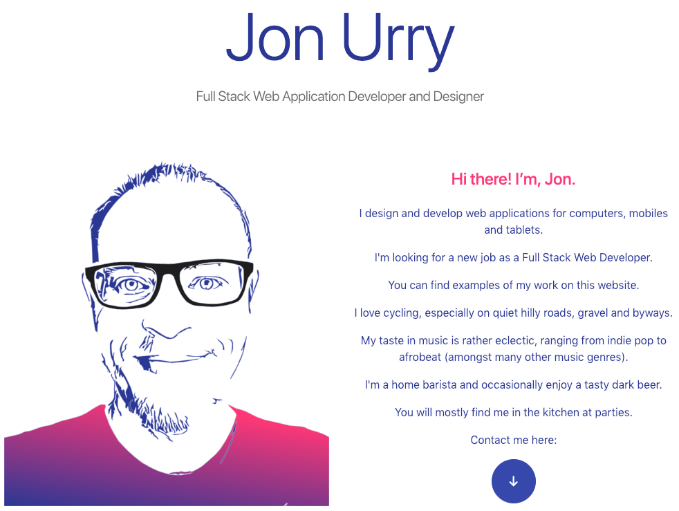

# Jon Urry's Portfolio

This is the portfolio website of Jon Urry - Web Application Developer and
Designer.

http://jon.urry.me

## Design Decisions

- **`Responsive Design`** - UI adapts to available screen size

- **`Progressive Web App`** - Using a Manifest and BrowserConfig the app can be installed on mobiles, tablets and Microsoft devices

- **`Flex Box`** - For content layout

- **`Colours`** - Inspired by Google material design palette

- **`SVG Animations`** - The image of my face is drawn over time

- **`SVG Icons`** - All icons are SVG so that they can be infinitely scaled and not lose detail. Keeps image file size small but quality high

- **`CSS Animations`** - Try hovering over the contact icons at the bottom of the website

## Tech Stack

- **`AWS Lambda`** - I wrote an Amazon Web Services Lambda function to handle Email enquiries. The repo for this can be found on [GitHub](https://github.com/jonurry/lambda-email-service)

- **`Bootstrap 4`** - The world's most popular front-end component library. An open source toolkit for developing with HTML, CSS, and JS.

- **`CSS Shapes`** - Section transitions are CSS clip shapes adapted from this [article](http://www.creativebloq.com/how-to/create-amazing-effects-with-css-shapes) by Daniel Crisp

- **`ESLint`** - A pluggable and configurable linter tool for identifying and reporting on patterns in JavaScript. Maintain your code quality with ease.

- **`Google Fonts`** - Making the web more beautiful, fast, and open through great typography.

- **`jQuery`** - JavaScript library designed to simplify HTML DOM tree traversal and manipulation, as well as event handling, CSS animation, and Ajax.

- **`JavaScript`** - High-level, interpreted programming language that conforms to the ECMAScript specification.

- **`SASS`** - Syntactically Awesome Style Sheets. Sass is the most mature, stable, and powerful professional grade CSS extension language in the world.

- **`SVG Animation`** - Inspired by this [article](https://jakearchibald.com/2013/animated-line-drawing-svg/) by Jake Archibald

## Deployment

This site is deployed on GitHub pages. I used [CodeKit](https://codekitapp.com/) to prepare and package the code to the `docs/` directory.
